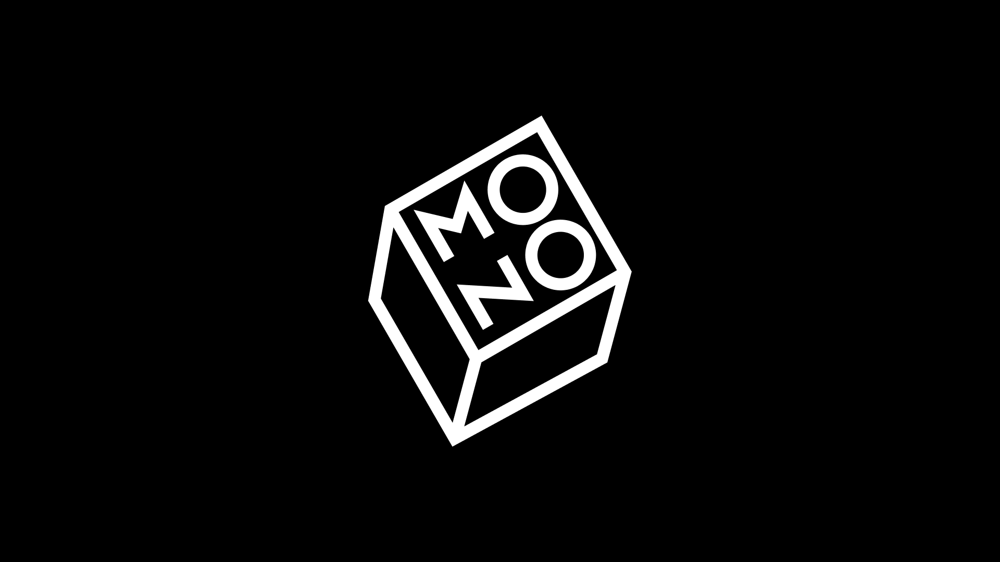
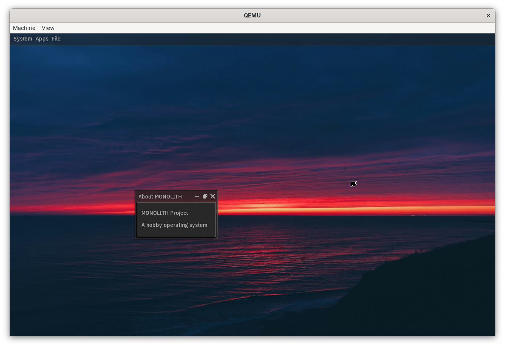

# MONOLITH

A WIP open source operating system with a focus on simplicity.

# Screenshots

# Documentation

- [Build instructions](docs/build.md)
- [Roadmap](docs/roadmap.md)
- [Contributing](docs/contributing.md)

# Credits

- [Limine](https://github.com/limine-bootloader/limine): A modern, advanced, portable and multiprotocol bootloader.
- [Flanterm by Mintsuki](https://codeberg.org/mintsuki/flanterm): A terminal emulator with support for multiple backends.
- [Unity by ThrowTheSwitch](https://github.com/ThrowTheSwitch/Unity/): A unit testing framework for C.
- [stb by nothings](https://github.com/nothings/stb): Single-header libraries for C.
- [IBM Plex Sans](https://fonts.google.com/specimen/IBM+Plex+Sans): An open-source font family from IBM.
- [Wallpaper by Ash](https://unsplash.com/photos/calm-body-of-water-during-horizon-LJOoIrjOSXw): The default desktop wallpaper.
